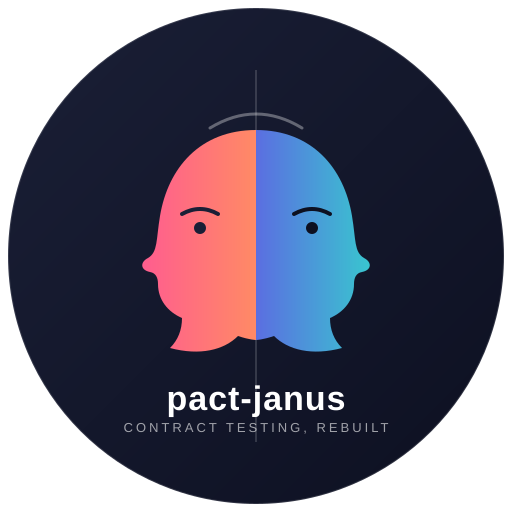

# Pact Janus
> Prototype of the rebuild/redesign of the Pact framework from the ground up

<table>
<tr>
<td width="140">
  
</td>
<td>

A ground-up redesign and rebuild of the Pact contract testing framework based on the [RFC Pact MkII](https://github.com/pact-foundation/roadmap/pull/146).

Janus is the Roman god of doorways, transitions, and duality (two faces looking in opposite directions).

Pact is a testing framework with duality (consumer and provider looking in opposite directions).

</td>
</tr>
</table>
